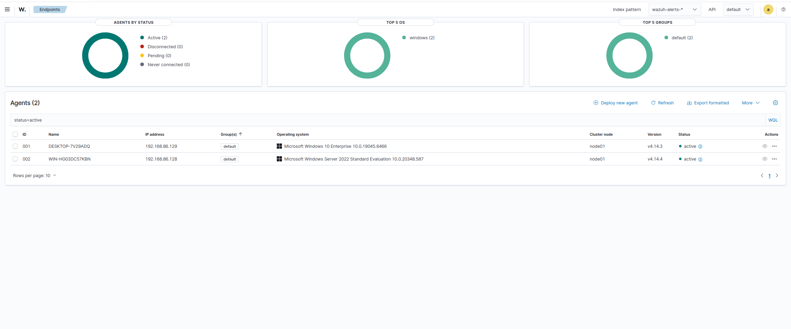
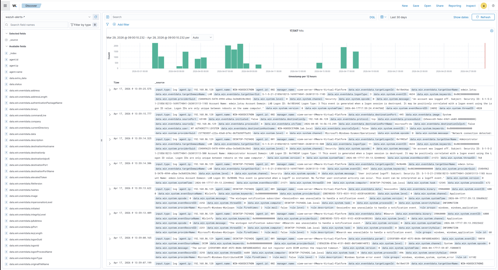
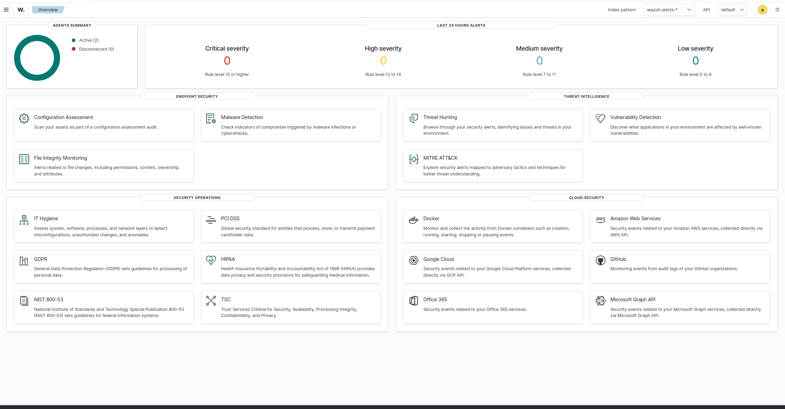
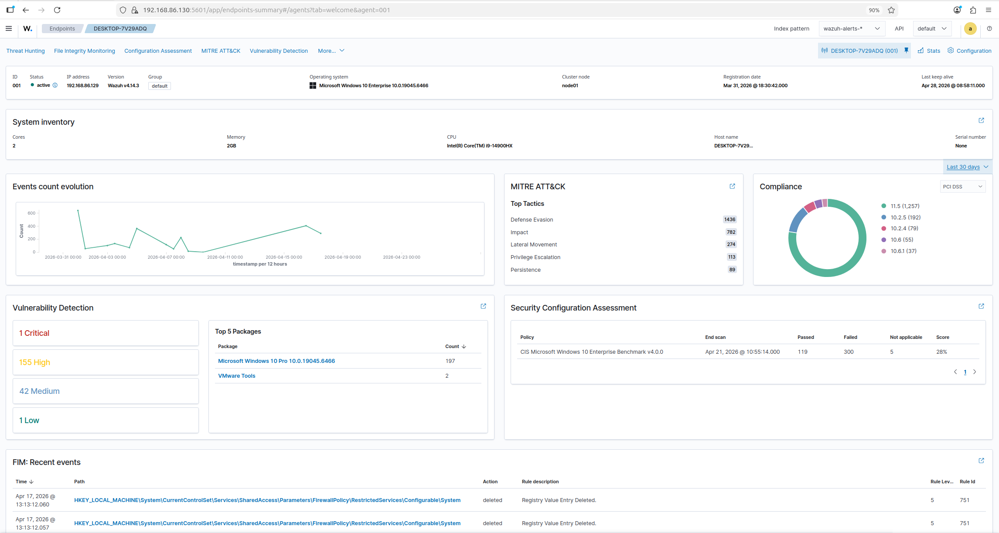

# Wazuh SIEM Deployment

## Overview

Deployed Wazuh SIEM on Ubuntu Server 24.04 to provide centralized security monitoring, log aggregation, and threat detection across the home lab environment.

**Objective:** Build enterprise-grade SIEM infrastructure capable of ingesting Windows endpoint telemetry, correlating security events, and providing real-time threat visibility.

---

## Architecture

### SIEM Components (Ubuntu Server)
- **Wazuh Manager** → Log processing and rule engine
- **Wazuh Indexer** → Elasticsearch-based log storage and search
- **Wazuh Dashboard** → Kibana-based web interface for visualization

**Deployment Model:** Single-node all-in-one installation (suitable for this lab environment)

### Monitored Endpoints
| Endpoint | OS | Role | Agent Status |
|----------|----|----|--------------|
| DESKTOP-7Y29ADQ | Windows 10 Enterprise | Domain-joined workstation | Active |
| WIN-HG03DC57KBN | Windows Server 2022 | Active Directory Domain Controller | Active |

**Note:** Kali Linux attacker machine is **not** monitored (intentional — simulates external threat actor)

---

## Deployment Validation

### 1. Agent Connectivity

**Result:** Both Windows agents connected and reporting to SIEM
- Agent 001: Windows 10 (192.168.86.129) - v4.14.3
- Agent 002: Windows Server 2022 (192.168.86.128) - v4.14.4

### 2. Log Ingestion

**Result:** 17,547 events indexed over 30-day period
- Logs from Windows Security Event Log
- Sysmon telemetry (Event ID 1, 3, etc.)
- Application and System event logs

**Timeline shows consistent log flow** — no gaps indicating agent disconnections or indexer issues.

### 3. Threat Detection Modules

**Active Modules:**
- **MITRE ATT&CK Mapping** → Maps alerts to adversary tactics and techniques
- **Vulnerability Detection** → Identifies CVEs in Windows packages
- **File Integrity Monitoring (FIM)** → Detects unauthorized file changes
- **Configuration Assessment** → CIS benchmark compliance scanning
- **Threat Hunting** → Interactive query interface for investigation

### 4. Agent-Level Telemetry

---

## Technical Implementation

### Network Configuration

**SIEM Server:**
- IP: 192.168.86.130
- Wazuh Manager Port: 1514 (agent communication)
- Dashboard Port: 5601 (HTTPS web UI)
- Indexer Port: 9200 (Elasticsearch API)

**Event Channels Monitored:**
- Windows Security Log (Event IDs 4624, 4625, 4720, etc.)
- Sysmon Operational Log (Event IDs 1, 3, 10, etc.)
- Windows System Log (service failures, reboots, etc.)

**Firewall Rules:**
- Allow inbound TCP 1514 from Windows agents
- Allow inbound TCP 5601 for dashboard access
- Allow inbound TCP 9200 for Filebeat (log forwarding)

---

## Key Capabilities Demonstrated

### 1. Centralized Logging
- Collected over 30 days
- Real-time log ingestion (typical latency: 2-5 seconds)
- Historical log retention and search

### 2. Threat Detection
- **MITRE ATT&CK framework integration** for contextualized alerting
- Out-of-the-box detection rules for:
  - Failed login attempts (brute force)
  - Privilege escalation
  - Lateral movement
  - Malware execution

### 3. Security Posture Visibility
- **Vulnerability scanning** against Windows packages
- **CIS benchmark compliance** assessment
- **File integrity monitoring** for critical system paths

### 4. Investigation Platform
- **Wazuh Discover** for ad-hoc log queries
- **Timeline visualization** for attack pattern recognition
- **Field filtering** for targeted event analysis

---

## Use Cases Enabled

This SIEM deployment enables the following detection scenarios:

| Scenario | Data Source | Detection Method |
|----------|-------------|------------------|
| **Port Scanning** | Sysmon Event ID 3 | Multiple rapid connections to different ports |
| **Brute Force Attacks** | Event ID 4625 | Clustered failed login attempts |
| **PowerShell Abuse** | Event ID 4104 | Script Block Logging of malicious commands |
| **Privilege Escalation** | Event ID 4672 | Special privileges assigned to user accounts |
| **Lateral Movement** | Event ID 4624 (Type 3) | Network logons from unexpected sources |
| **Malware Execution** | Sysmon Event ID 1 | Process creation with suspicious command lines |

**These scenarios will be documented in the [attack-simulations](../03-attack-simulations/) directory.**

---

## Deployment Highlights

### What Went Well
**Single-node installation worked reliably** — all components on one Ubuntu VM  
**Agent deployment straightforward** — Windows MSI installer, minimal config  
**Log flow validation quick** — events visible in dashboard within minutes  
**Built-in MITRE ATT&CK mapping** — automatic technique tagging  

### Challenges Solved
**SSL certificate verification errors** → Disabled verification for lab environment  
**Filebeat connectivity issues** → Updated `/etc/hosts` to use hostname instead of IP  
**Wazuh Indexer not auto-starting** → Enabled service with `systemctl enable`  
**Sysmon network logging disabled** → Modified config to `onmatch="exclude"` with no rules  

**Troubleshooting details documented in:** `troubleshooting.md`

---

## Related Projects

- [Sysmon Deployment](../02-sysmon-deployment/) → Enhanced endpoint telemetry
- [Attack Simulations](../03-attack-simulations/) → Detection validation scenarios

---

## References

- [Wazuh Official Documentation](https://documentation.wazuh.com/)
- [Wazuh Agent Installation Guide](https://documentation.wazuh.com/current/installation-guide/wazuh-agent/index.html)
- [MITRE ATT&CK Framework](https://attack.mitre.org/)

---

**Note:** Installation steps intentionally omitted. This project focuses on **detection engineering** and **attack simulation**, not infrastructure setup. Wazuh provides excellent installation documentation for those interested in deployment procedures.

---

[← Back to Main Lab](../../README.md)
