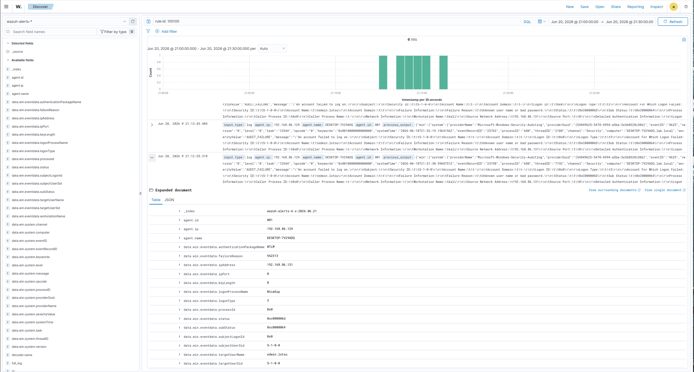
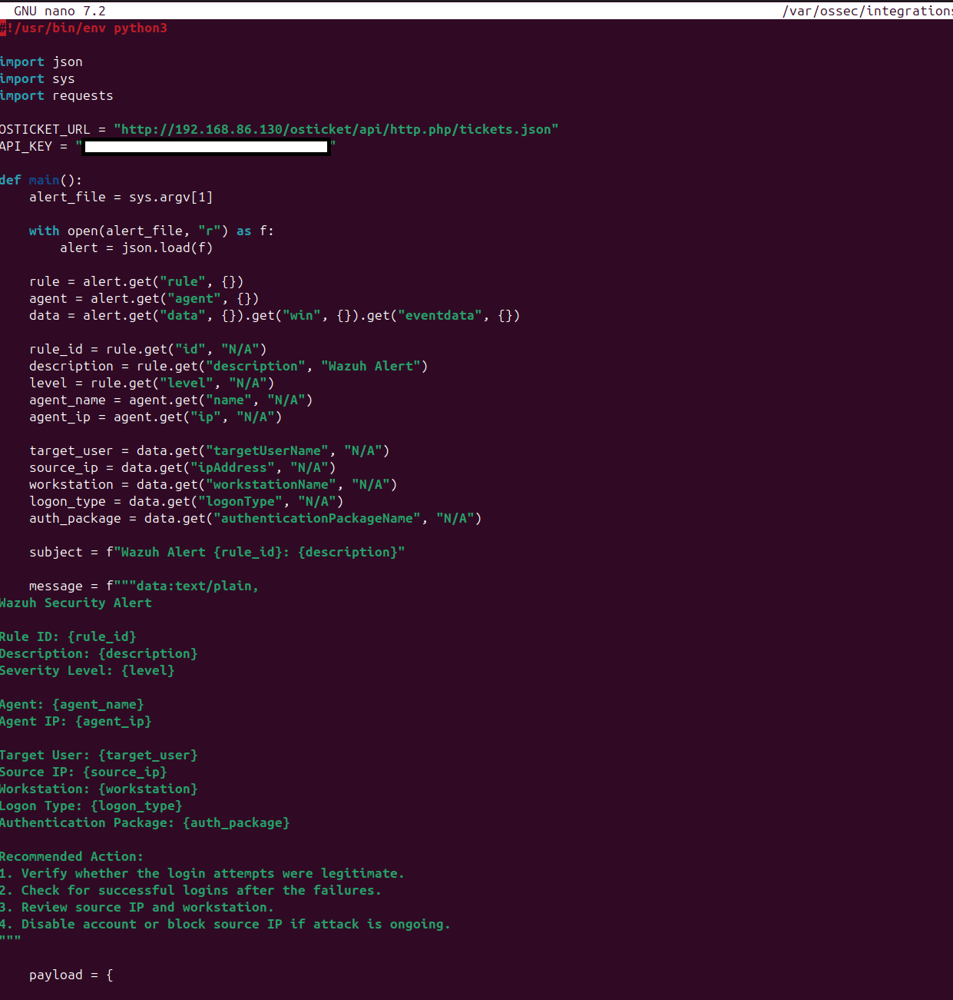
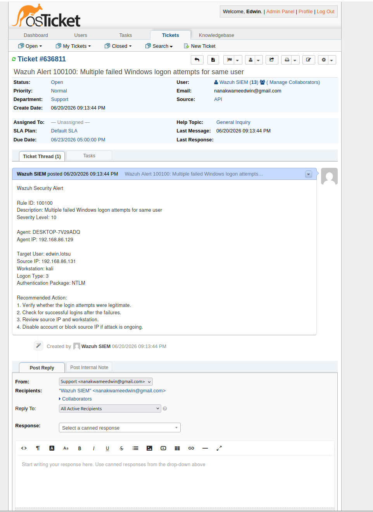
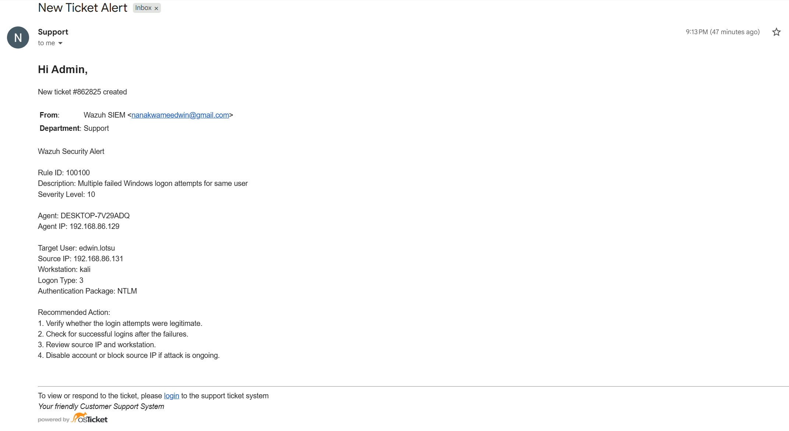

# Ticketing Automation and Email Alerting

## Overview

This project demonstrates the integration of Wazuh SIEM with osTicket to automate incident creation and analyst notification. Security alerts generated by Wazuh are automatically forwarded to osTicket through a custom Python integration script, creating tickets that contain relevant alert details. osTicket then sends email notifications to ensure analysts are informed of security events in real time.

This implementation simulates a basic Security Operations Center (SOC) workflow where alerts are transformed into actionable incidents instead of remaining isolated SIEM events.

---

## Objective

The objective of this project was to:

* Automate incident creation from Wazuh alerts.
* Integrate Wazuh with osTicket using the osTicket REST API.
* Generate structured incident tickets containing relevant security information.
* Configure SMTP notifications for analyst awareness.
* Demonstrate an end-to-end alert management workflow.

---

## Lab Environment

| Component            | Purpose                       |
| -------------------- | ----------------------------- |
| Wazuh 4.14.3         | SIEM Platform                 |
| Windows 10 Client    | Log Source                    |
| Sysmon               | Endpoint Telemetry            |
| Ubuntu Server        | Wazuh Manager / osTicket Host |
| osTicket 1.18.1      | Ticketing System              |
| Gmail SMTP           | Email Notifications           |
| Custom Python Script | Alert-to-Ticket Automation    |

---

## Architecture

```text
Kali Attacker
      │
      ▼
Windows Client
(Event ID 4625)
      │
      ▼
Wazuh Agent
      │
      ▼
Wazuh Manager
(Custom Rule 100100)
      │
      ▼
custom-osticket.py
      │
      ▼
osTicket API
      │
      ▼
Ticket Creation
      │
      ▼
Email Notification
```

---

## Integration Workflow

1. A security event is detected by Wazuh.
2. Wazuh generates an alert based on a custom detection rule.
3. A custom Python integration script processes the alert JSON.
4. The script extracts relevant alert fields.
5. Alert details are submitted to osTicket through the REST API.
6. osTicket automatically creates a ticket.
7. SMTP notifications are sent to the analyst.
8. The analyst receives an actionable incident notification.

---

## Screenshots

### Wazuh Alert Detection

Wazuh generated Rule 100100 after detecting multiple failed Windows logon attempts against the same account.



---

### Custom Python Integration

The custom integration script parses Wazuh alert data and submits incident information to osTicket using the REST API.



---

### Automatic Ticket Creation

osTicket automatically creates a ticket containing the relevant alert information.



---

### Email Notification

SMTP integration successfully delivers an analyst notification email after ticket creation.



---

## Validation Tests

### Test 1 – Wazuh Alert Generation

**Condition:**

Custom Rule 100100 triggered after multiple failed Windows logon attempts.

**Result:**

* Alert successfully generated.
* Alert metadata captured.
* Relevant user and source information preserved.

**Status:**

✅ Successful

---

### Test 2 – Automatic Ticket Creation

**Condition:**

Custom integration script forwarded the alert to osTicket.

**Result:**

* Ticket automatically created.
* Ticket ID assigned.
* Alert details included in ticket body.

**Status:**

✅ Successful

---

### Test 3 – Email Notification

**Condition:**

osTicket SMTP notification configured using Gmail SMTP.

**Result:**

* Email successfully delivered.
* Ticket information included in notification.
* Analyst alerted without direct access to Wazuh.

**Status:**

✅ Successful

---

## Results

The integration successfully automated the incident management workflow by converting Wazuh alerts into actionable support tickets and analyst notifications.

The completed workflow consisted of:

```text
Wazuh Alert
      ↓
Custom Integration Script
      ↓
osTicket API
      ↓
Ticket Creation
      ↓
Email Notification
```

This implementation demonstrates how SIEM-generated alerts can be integrated into a ticket-driven SOC workflow to improve incident visibility and response efficiency.

---

## Lessons Learned

* SIEM alerts become more actionable when integrated with a ticketing platform.
* API authentication and source IP authorization are critical when integrating osTicket.
* Custom integrations provide flexibility beyond native SIEM functionality.
* Email notifications ensure analysts are informed even when not actively monitoring the SIEM dashboard.
* Automating ticket creation reduces manual incident handling and improves response workflows.
* Troubleshooting integrations often requires validating both API functionality and SMTP configuration.

---

## Related Scenarios

* 01 – Nmap Port Scan Detection
* 02 – Failed Login Detection
* 03 – Brute Force Detection
