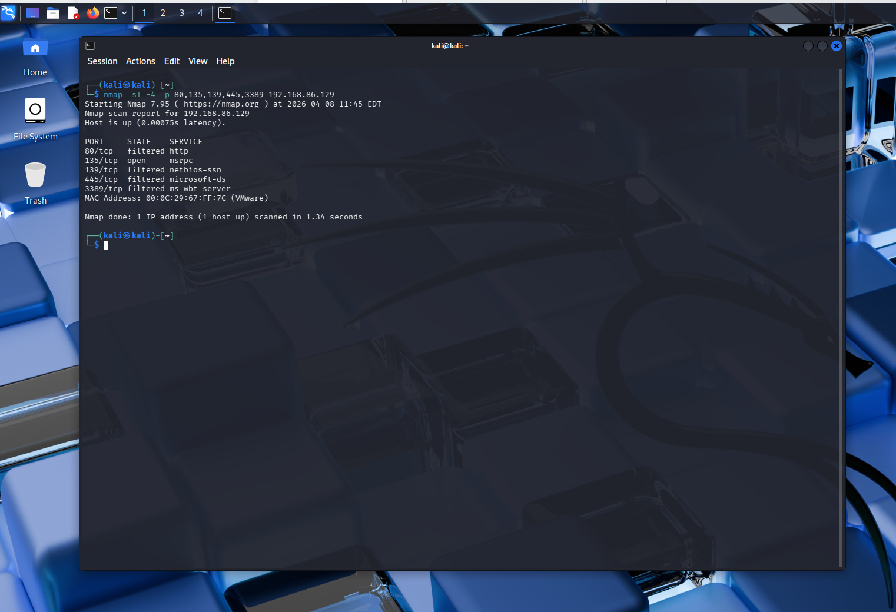
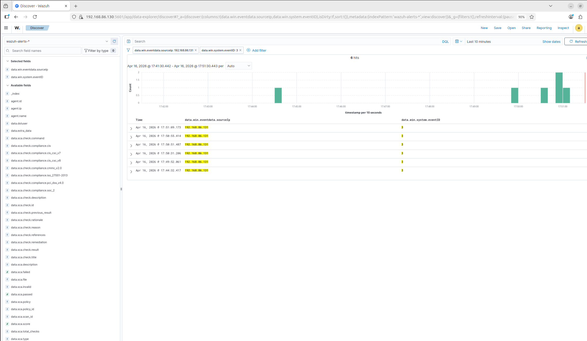
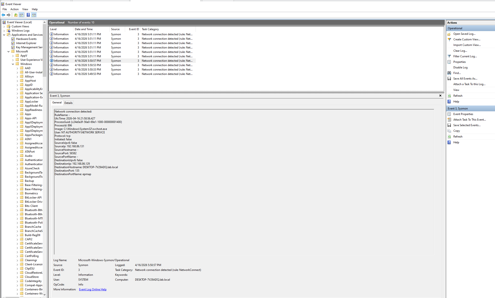
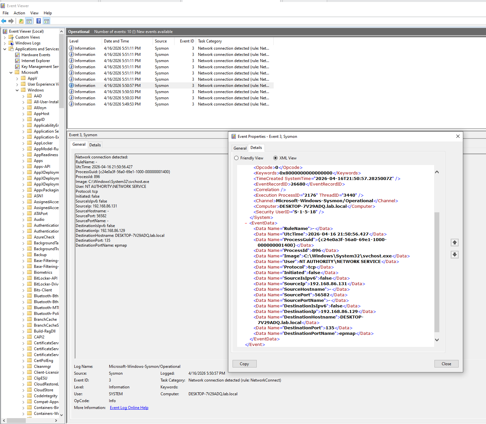

# Attack Simulation: Nmap Port Scanning Detection

## 📋 Scenario Overview

**Objective:** Detect network reconnaissance (port scanning) using SIEM and endpoint telemetry

**Attacker:** Kali Linux (`192.168.86.131`)  
**Target:** Windows 10 Client (`192.168.86.129`)  
**Attack Tool:** Nmap 7.95  
**Detection Tools:** Wazuh SIEM, Sysmon Event ID 3

**MITRE ATT&CK Technique:** [T1046 - Network Service Scanning](https://attack.mitre.org/techniques/T1046/)

---

## 🎯 Attack Execution

### Attack Command
```bash
nmap -sT -4 -p 80,135,139,445,3389 192.168.86.129
```

**Parameters:**
- `-sT` → TCP Connect scan (full 3-way handshake)
- `-4` → IPv4 only
- `-p 80,135,139,445,3389` → Target common Windows service ports

**Scan Duration:** ~1.33 seconds  
**Ports Scanned:** 5 (HTTP, RPC, NetBIOS, SMB, RDP)

### Results
|PORT    | STATE    | SERVICE |
|--------|----------|---------|
|80/tcp  | filtered | http    |
|135/tcp | open     | msrpc   |
|139/tcp | filtered | netbios-ssn|
|445/tcp | filtered | microsoft-ds|
|3389/tcp|filtered  | ms-wbt-server|


**Screenshot:**  


---

## 🔍 Detection Strategy

### Data Sources
1. **Sysmon Event ID 3** → Network connection logging on endpoint
2. **Wazuh SIEM** → Centralized log aggregation and correlation
3. **Windows Event Viewer** → Native security logging

### Detection Query (Wazuh Discover)
data.win.system.eventID: 3 AND data.win.eventdata.sourceIp: 192.168.86.131

### Expected Indicators
- Multiple TCP connections from single source IP
- Connections to various ports within short timeframe (<2 seconds)
- Sequential source port changes (ephemeral ports)
- Connections to well-known service ports

---

## 📊 Detection Results

### Wazuh Dashboard
**Timeline Analysis:**  


**Event Count:** 9 network connection events logged in 1.5 seconds

### Sysmon Event Details


**Key Fields Captured:**
Event ID: 3 (Network connection detected)
Source IP: 192.168.86.131 (Kali)
Destination IP: 192.168.86.129 (Windows 10)
Destination Port: 135 (example)
Protocol: tcp
Process: C:\Windows\System32\svchost.exe
User: NT AUTHORITY\NETWORK SERVICE

### Windows Event Viewer Validation


Confirmed Sysmon logs are being generated on the endpoint before forwarding to Wazuh.

---

## 🧪 Validation Tests

### Test 1: Verify Sysmon Logging
**Command (on Windows 10):**
```powershell
Get-WinEvent -LogName "Microsoft-Windows-Sysmon/Operational" -MaxEvents 10 | Where-Object {$_.Id -eq 3}
```

**Result:** ✅ Event ID 3 entries present

### Test 2: Verify Wazuh Ingestion
**Query:** `data.win.system.eventID: 3`  
**Result:** ✅ 9 events indexed in Wazuh

### Test 3: Timeline Correlation
**Observation:** Spike in events matches exact time of Nmap scan  
**Result:** ✅ Real-time detection confirmed

---

## 📈 Analysis

### Why This Detection Works
1. **Endpoint Visibility:** Sysmon captures network connections at the process level
2. **Centralized Correlation:** Wazuh aggregates logs from multiple endpoints
3. **Pattern Recognition:** Multiple rapid connections = scanning behavior
4. **Low Latency:** Events appeared in SIEM within seconds

```diff
- text in red
### False Positive Considerations
**Legitimate scenarios that could trigger similar alerts:**
- Automated vulnerability scanners (Nessus, Qualys)
- Configuration management tools (Ansible, Puppet)
- Network monitoring solutions (PRTG, SolarWinds)
- Load balancers performing health checks
```

**Mitigation:** Whitelist known scanner IPs, adjust alerting thresholds

### Detection Gaps
- **Stealth Scans:** SYN scans (`-sS`) may generate fewer logs
- **Slow Scans:** Nmap's `--scan-delay` could evade time-based correlation
- **Fragmented Packets:** Advanced evasion techniques may bypass inspection

---

## 💡 Lessons Learned

1. **Sysmon is critical** for network visibility on Windows endpoints
2. **TCP Connect scans are noisy** — easy to detect but also easy to avoid
3. **SIEM correlation** makes pattern detection straightforward
4. **Timeline analysis** is powerful for identifying suspicious bursts of activity

---

## 🚀 Next Steps

- [ ] Test detection against SYN scans (`nmap -sS`)
- [ ] Implement custom Wazuh rule for automated alerting
- [ ] Capture network traffic with Wireshark for dual-layer analysis
- [ ] Build detection rule for slow scans (time-windowed correlation)

---

## 📚 References

- [MITRE ATT&CK T1046](https://attack.mitre.org/techniques/T1046/)
- [Sysmon Event ID 3 Documentation](https://learn.microsoft.com/en-us/sysinternals/downloads/sysmon)
- [Wazuh Detection Rules](https://documentation.wazuh.com/current/user-manual/ruleset/index.html)

---

[← Back to Main Lab](../../README.md)
