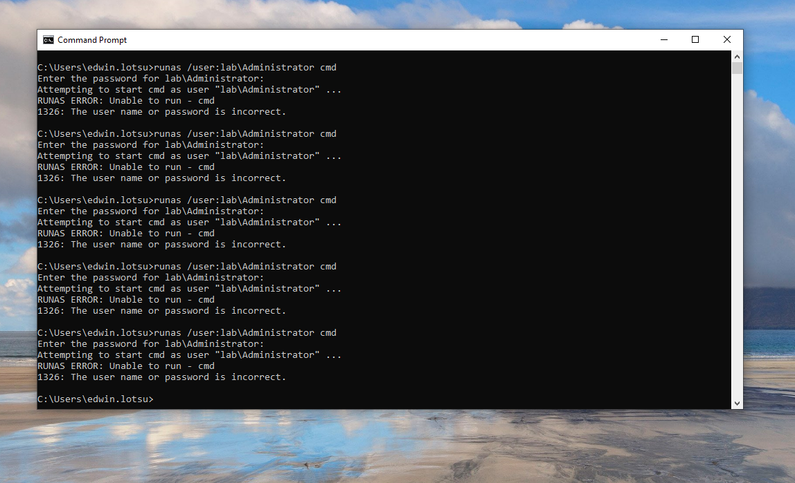
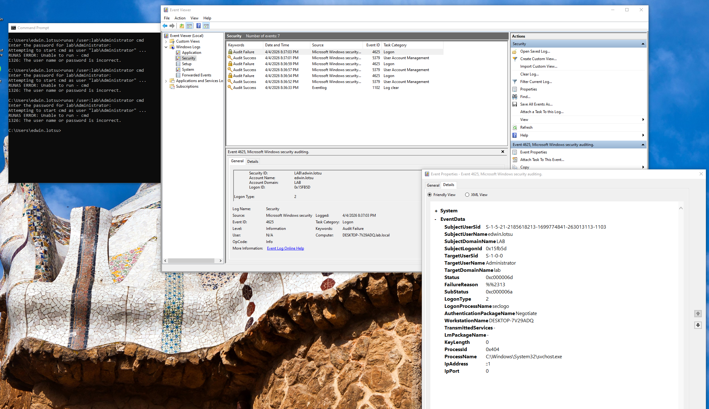
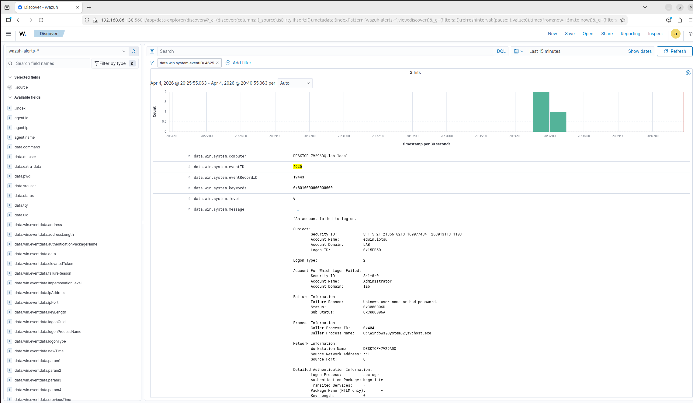
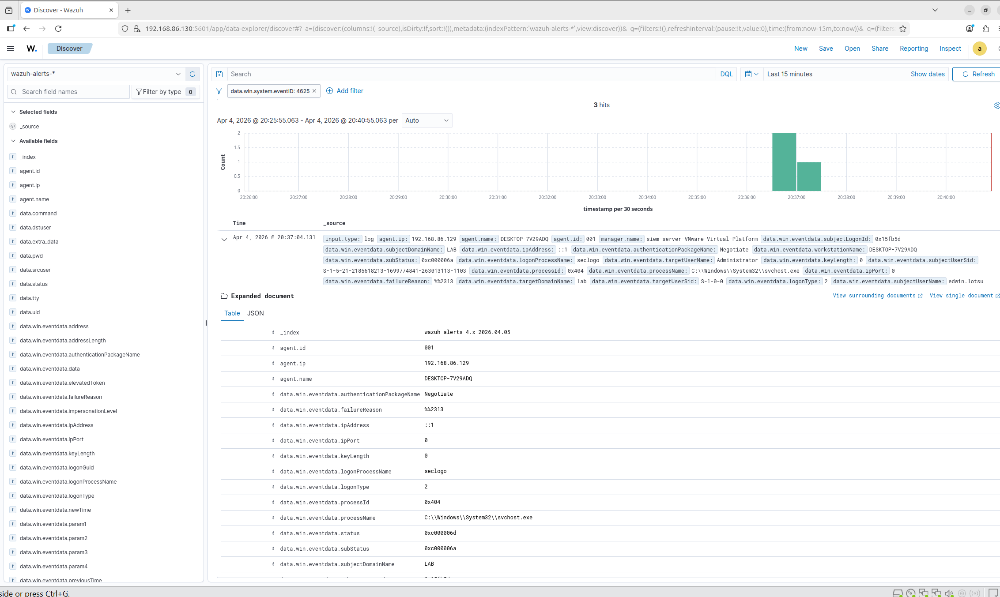

# Attack Simulation: Failed Login Detection

## Scenario Overview

**Objective:** Detect brute force authentication attempts using Windows Event Logs and SIEM correlation

**Attacker:** Windows 10 Client (local simulation of credential attack)  
**Target:** Domain Controller / Local Administrator Account  
**Attack Tool:** Windows `runas` command (manual credential stuffing)  
**Detection Tools:** Wazuh SIEM, Windows Security Event Log (Event ID 4625)

**MITRE ATT&CK Technique:** [T1110.001 - Brute Force: Password Guessing](https://attack.mitre.org/techniques/T1110/001/)

---

## Attack Execution

### Attack Command
```cmd
runas /user:lab\Administrator cmd
```

**Execution Method:**
- Repeatedly attempted to elevate privileges using incorrect credentials
- Triggered multiple failed login attempts in rapid succession
- Simulates credential stuffing or password guessing attack

**Attack Duration:** ~3 minutes  
**Failed Attempts:** 7 sequential failures

### Attack Process
1. Open Command Prompt on Windows 10 Client
2. Execute `runas` command targeting domain administrator account
3. Enter incorrect password when prompted
4. Repeat multiple times to simulate brute force behavior

**Screenshot:**  


---

## Detection Strategy

### Data Sources
1. **Windows Security Event Log** → Event ID 4625 (An account failed to log on)
2. **Wazuh SIEM** → Centralized log aggregation and correlation
3. **Sysmon** → Process execution context (optional enhancement)

### Detection Query (Wazuh Discover)
```
data.win.system.eventID: 4625
```

**Filter by specific user:**
```
data.win.system.eventID: 4625 AND data.win.eventdata.targetUserName: Administrator
```

**Filter by account from specific machine:**
```
data.win.system.eventID: 4625 AND data.win.system.computer: DESKTOP-7Y29ADQ.lab.local
```

### Expected Indicators
- Multiple Event ID 4625 logs from same source in short timeframe
- Same target account (`Administrator`) across all attempts
- Failure Reason: `%%2313` (Unknown user name or bad password)
- Sub Status: `0xC000006A` (Incorrect password)
- Logon Type: `2` (Interactive logon)

---

## Detection Results

### Windows Event Viewer
**Timeline Analysis:**  


**Event Count:** 7 failed authentication attempts captured

**Event Details:**
- **Event ID:** 4625 (Audit Failure)
- **Source:** Microsoft-Windows-Security-Auditing
- **Task Category:** Logon
- **Keywords:** Audit Failure

### Wazuh Dashboard - Event Details


**Key Fields Captured:**
```
Event ID: 4625
Computer: DESKTOP-7Y29ADQ.lab.local
Target User: Administrator
Account Domain: lab
Logon Type: 2 (Interactive)
Failure Reason: Unknown user name or bad password (0xC0000064)
Sub Status: 0xC000006A
Process Name: C:\Windows\System32\svchost.exe
Workstation Name: DESKTOP-7Y29ADQ
Authentication Package: Negotiate
Caller Process ID: 0x404
```

### Wazuh Discover - Structured Log Data


**Timeline Spike:** Clear clustering of failed login events within 3-minute window

**Indexed Fields:**
- `data.win.system.eventID`: 4625
- `data.win.eventdata.targetUserName`: Administrator
- `data.win.eventdata.failureReason`: %%2313
- `data.win.eventdata.subStatus`: 0xC000006A
- `data.win.eventdata.logonType`: 2
- `agent.ip`: 192.168.86.129 (Windows 10 Client)

---

## Validation Tests

### Test 1: Verify Event ID 4625 Logging
**Command (on Windows 10):**
```powershell
Get-WinEvent -FilterHashtable @{LogName='Security'; Id=4625} -MaxEvents 10
```

**Result:** Multiple Event ID 4625 entries present

### Test 2: Verify Wazuh Ingestion
**Query:** `data.win.system.eventID: 4625`  
**Result:** 7+ events indexed in Wazuh within last 15 minutes

### Test 3: Correlation Analysis
**Observation:** All failures show same target account, same source workstation, sequential timing  
**Result:** Pattern consistent with credential attack

---

## Analysis

### Why This Detection Works
1. **Native Windows Logging:** Event ID 4625 is enabled by default on Windows
2. **Centralized Visibility:** Wazuh aggregates failed login attempts across all endpoints
3. **Behavioral Pattern:** Clustering of failures = abnormal authentication behavior
4. **Context Preservation:** Logs include failure reason, source workstation, and account details

### Attack Indicators Observed
| Indicator | Value | Significance |
|-----------|-------|--------------|
| **Event ID** | 4625 | Failed logon attempt |
| **Sub Status** | 0xC000006A | Wrong password (not wrong username) |
| **Logon Type** | 2 | Interactive (local console or RDP) |
| **Target Account** | Administrator | High-value privileged account |
| **Failure Count** | 7 in 3 minutes | Exceeds normal user typo behavior |

### Understanding Failure Codes
- **0xC0000064:** User name does not exist
- **0xC000006A:** Correct username, wrong password ← **What we observed**
- **0xC000006D:** Bad username or password (generic failure)
- **0xC0000234:** User account locked out

**Our scenario:** Attacker knows the username (`Administrator`) but is guessing passwords

### False Positive Considerations
**Legitimate scenarios that could trigger similar alerts:**
- User forgot password after password change
- Caps Lock key enabled during login
- Password manager auto-fill with outdated credentials
- Service account with expired password
- User typing too fast and making typos

**Mitigation:** 
- Set alert threshold (e.g., 5+ failures in 5 minutes)
- Whitelist known service accounts
- Correlate with successful login afterward (user corrected mistake vs. persistent failure)

### Detection Gaps
- **Slow Brute Force:** Attacker spacing attempts over hours/days may evade time-based correlation
- **Password Spraying:** Trying one password across many accounts generates fewer failures per account
- **Credential Stuffing:** Valid credentials from breach won't generate Event ID 4625

---

## Recommended Response Actions

### Immediate Triage (SOC Analyst Workflow)
1. **Verify legitimacy:** Contact user to confirm if they were attempting to log in
2. **Check for success:** Query for Event ID 4624 (successful login) after failures
   - If success after failures → potentially compromised account
   - If no success → attack likely unsuccessful
3. **Review source:** Is the source IP internal or external (via RDP)?
4. **Assess impact:** Check if account is privileged (Domain Admin, Enterprise Admin)

### Containment Actions
- **Temporary lockout:** Disable account if attack is ongoing and user cannot be reached
- **Force password reset:** Require immediate password change if account may be compromised
- **Block source IP:** If attack is from external IP (RDP brute force)
- **Enable MFA:** Prevent future password-only authentication

### Long-Term Improvements
- **Account Lockout Policy:** Lock account after 5 failed attempts
- **Custom Wazuh Rule:** Alert on 5+ Event ID 4625 within 5 minutes for same account
- **Honeypot Accounts:** Create decoy admin accounts to detect attacker reconnaissance
- **Require MFA:** Eliminate password-only authentication for privileged accounts

---

## Lessons Learned

1. **Event ID 4625 is noisy but valuable** — many false positives but critical for brute force detection
2. **Sub Status codes matter** — differentiates wrong username vs. wrong password (attacker knowledge)
3. **Time-based correlation is key** — single failure = user error, 7 failures in 3 minutes = attack
4. **SIEM enables pattern recognition** — manual Event Viewer review doesn't scale across 100s of endpoints

---

## Next Steps

- [ ] Build custom Wazuh detection rule for automated alerting (threshold: 5 failures in 5 minutes)
- [ ] Test detection against distributed brute force (multiple source IPs)
- [ ] Implement automated response (account lockout via PowerShell script triggered by Wazuh)
- [ ] Simulate password spraying attack (1 password, many accounts) for comparison

---

## References

- [MITRE ATT&CK T1110.001 - Brute Force: Password Guessing](https://attack.mitre.org/techniques/T1110/001/)
- [Microsoft Event ID 4625 Documentation](https://learn.microsoft.com/en-us/windows/security/threat-protection/auditing/event-4625)
- [Windows Security Log Event ID Reference](https://www.ultimatewindowssecurity.com/securitylog/encyclopedia/event.aspx?eventid=4625)
- [NIST SP 800-63B - Authentication Guidelines](https://pages.nist.gov/800-63-3/sp800-63b.html)

---

## Related Scenarios

- [01 - Nmap Port Scan Detection](../01-nmap-port-scan/)
- - PowerShell Attack Detection

---

[← Back to Main Lab](../../README.md)
